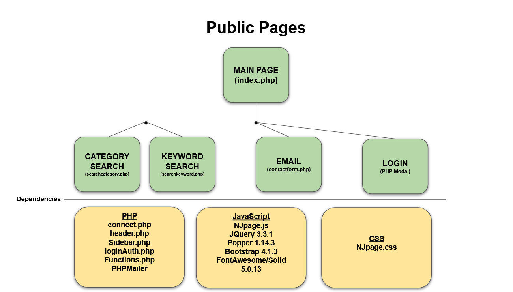
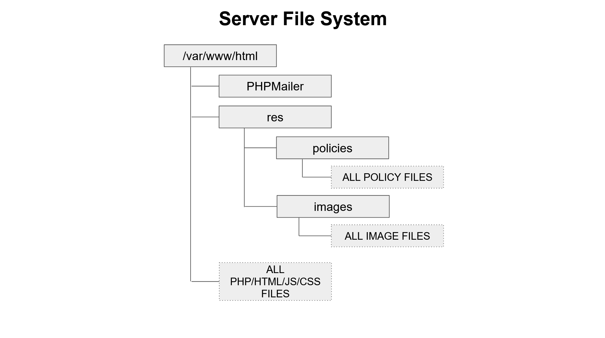

# NJ DCF Website Repo
## Introduction
This website is being built by students at Holy Ghost Preparatory School, with oversight by their instructor (Mr. Brandon Petcaugh). It will serve to replace the existing site housing all files/policies/regulations for the NJ Department of Children and Families. [Link To Existing Site](https://www.nj.gov/dcf/policy_manuals/toc.shtml) 

## Webpage Flowcharts
The following diagrams should be used to determine how the pages in the repository are connected to one another. The private portion of the site is broken into two categories: pages that all users can see are highlighted in 'green,' and pages that admin uses can see are 'red.' 

## Website Functionality
### Public Functions
This site will be used by the public to search and download policies. It also contains an email template which can be used to contact the department with any requests.

### Department Functions
This site will be used for three primary functions:
1. Add new policies and regulations
2. Mark policies as obsolete
3. Modify existing policies

Diagrams for the workflow of these functions will be placed here.

## Server Setup
### File System

### Database
There are several tables used in the database. A detailed view of all table structures can be viewed in the 'res' folder in 'DBtablestructure.sql', and a brief list is included here.

#### Database Tables
1. users: stores all information for department member profiles
2. policies: stores information on all policies for the site
3. policychanges: stores information for updates and changes that have been made to each policy

## General Information
### Who uses this site?
This site would be used internally by 46 local offices, with approximately 6600 staff, and 12 area offices.

### Sensitive Files
Some files were not included in this repository, since they contain passwords, database logins, or other sensitive information. These are available upon request. 

## Current Production ToDo List
1. Review the following documents, and add to file diagrams: logUpdateResults, emailsend, searchkeyresults
